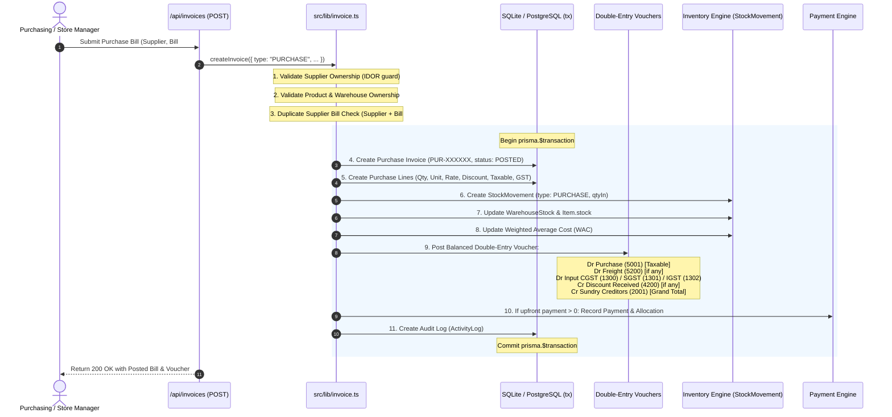
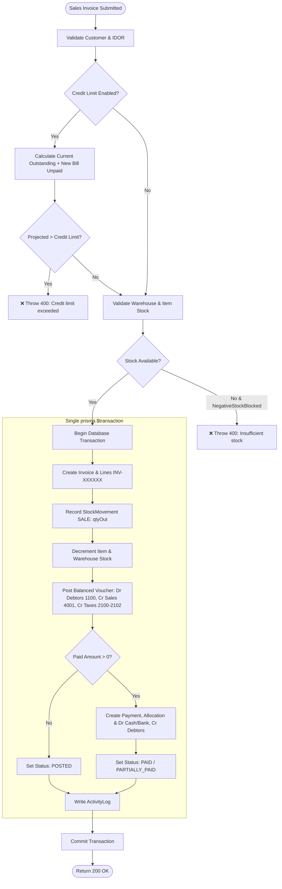
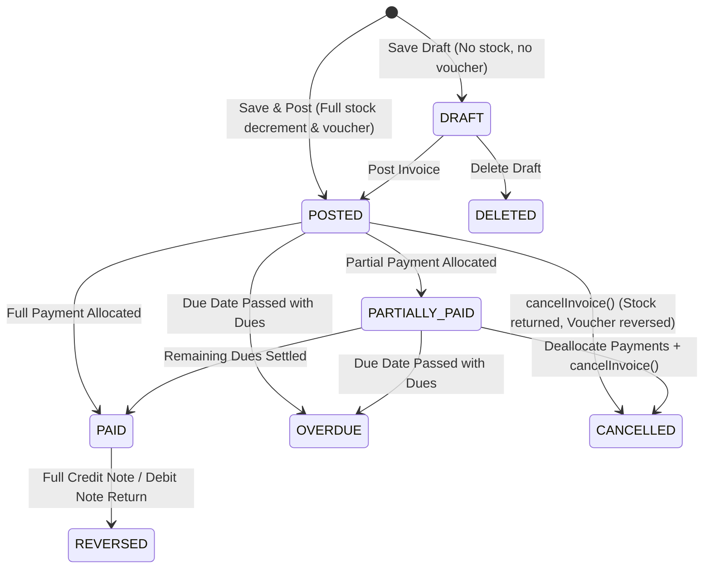

# Taily Financial Transactions & Double-Entry Ledger Engine
## Phase 4 Production-Grade Architecture & Workflow Documentation

---

### 1. Executive Summary

Phase 4 transforms Taily from a lightweight billing app into an enterprise-grade ERP transaction engine. All financial, inventory, and accounting updates are executed within **strict atomic database transactions (`prisma.$transaction`)**, guaranteeing zero partial writes, strict double-entry ledger balance ($Dr = Cr$), proactive credit limit validation, duplicate supplier invoice prevention, multi-invoice payment allocation, and rigorous line-level return quantity enforcement.

---

### 2. Transaction Architecture & Flow Diagrams

#### A. Purchase 12-Step Atomic Posting Workflow

Every vendor purchase bill executes through 12 contiguous atomic steps. If any step fails, the entire transaction is rolled back with zero side effects.



---

#### B. Sales Atomic Posting & Credit Limit Guard



---

#### C. Multi-Invoice Payment Allocation (`PaymentAllocation`)

A single cash, bank, or UPI settlement can be split across multiple invoices with automatic advance balance tracking:

```mermaid
graph LR
    P[Customer Payment: ₹15,000] --> Alloc1[Allocation 1: Invoice A (₹8,000)]
    P --> Alloc2[Allocation 2: Invoice B (₹4,500)]
    P --> Adv[Unallocated Advance: ₹2,500]
    
    Alloc1 --> InvA[Invoice A Status: PAID]
    Alloc2 --> InvB[Invoice B Status: PARTIALLY_PAID]
    Adv --> AdvLedger[Cr Customer Advance Account 2201]
```

---

#### D. Document Status Lifecycle State Machine



---

### 3. Core Engine Implementations

1. **`src/lib/invoice.ts`**:
   - `createInvoice`: Unified engine for Sales and Purchases. Supports all header fields (`supplierInvoiceNo`, `supplierInvoiceDate`, `billingAddress`, `shippingAddress`, `placeOfSupply`, `salesperson`, `warehouseId`, `orderNo`, `paymentTerms`), line-level discounts, header charges (`freight`, `otherCharges`, `discount`), instant upfront payment, duplicate supplier invoice detection, and customer credit limit validation.
   - `cancelInvoice`: Prevents casual deletion of posted records. Atomically posts reversing stock movements (`SALE_RETURN` / `PURCHASE_RETURN`), sets `voucher.isReversed = true`, logs reversing journal entries, and marks invoice status `CANCELLED`.

2. **`src/lib/paymentAllocation.ts`**:
   - `recordPayment`: Allocates payments across $N$ invoices, updates each invoice's `paidAmount` and `status` (`PAID` vs `PARTIALLY_PAID`), tracks remaining funds as `unallocatedAmount` (Advances), and posts balanced double-entry vouchers.
   - `reversePayment`: Safely reverses payment allocations, restores invoice pending balances, and posts reversing vouchers.

3. **`src/lib/outstanding.ts`**:
   - `getOutstandingReport`: Computes live receivables, payables, customer credit exposures, and 4-tier aging buckets:
     - Current (0 - 30 Days)
     - 31 - 60 Days
     - 61 - 90 Days
     - > 90 Days Overdue

4. **Return Quantity Guards (`sales-returns` & `purchase-returns`)**:
   - Strictly enforces: $\text{Requested Return Qty} \le \text{Purchased/Sold Qty} - \text{Already Returned Qty}$.
   - Atomically increments `returnedQty` on the original line.
   - Links `originalInvoiceId` and `originalLineId` for complete auditability.

---

### 4. Automated Test Results (`scripts/test-phase4.ts`)

```
=======================================================
💰  TAILY PHASE 4: FINANCIAL TRANSACTIONS TEST SUITE
=======================================================

--- Group 1: Purchase Flow (12-step atomic posting) ---
  ✅ PASS: Purchase bill created with type PURCHASE
  ✅ PASS: Purchase bill posted with status POSTED
  ✅ PASS: Grand total computed correctly with GST, freight, and discounts
  ✅ PASS: StockMovement row created with qtyIn = 10
  ✅ PASS: Item stock increased to 10 (Actual: 10)
  ✅ PASS: Warehouse stock increased to 10 (Actual: 10)
  ✅ PASS: Double-entry purchase voucher created
  ✅ PASS: Double-entry balanced: Dr ₹118110 = Cr ₹118110
  ✅ PASS: Supplier payable balance equals bill grand total (₹117810)
  ✅ PASS: Payment to supplier completed successfully
  ✅ PASS: Purchase bill marked PAID after full settlement (status: PAID)
  ✅ PASS: Purchase bill paidAmount updated

--- Group 2: Duplicate Supplier Invoice Detection ---
  ✅ PASS: Duplicate supplier invoice number blocked by system policy

--- Group 3: Customer Credit Limit Enforcement ---
  ✅ PASS: Sale exceeding customer credit limit (₹25,000) was blocked
  ✅ PASS: Sale within credit limit posted successfully
  ✅ PASS: Item stock reduced from 10 to 9 after sale (Actual: 9)

--- Group 4: Multi-Invoice Payment Allocation & Advance Balances ---
  ✅ PASS: Payment allocated across 2 distinct invoices
  ✅ PASS: Advance amount preserved as unallocated (₹3000)
  ✅ PASS: Invoice 1 settled to PAID
  ✅ PASS: Invoice 2 settled to PAID

--- Group 5: Sales Return with Strict Quantity Limits ---
  ✅ PASS: Sale created with 5 units of product
  ✅ PASS: Line returnedQty incremented to 2 (Actual: 2)
  ✅ PASS: Available returnable qty is 3 (5 - 2)
  ✅ PASS: Attempting to return 4 units when only 3 remain returnable is blocked

--- Group 6: Invoice Cancellation & Financial Reversal ---
  ✅ PASS: Stock deducted by 1 unit on invoice creation
  ✅ PASS: Invoice status updated to CANCELLED
  ✅ PASS: Cancellation reason recorded
  ✅ PASS: Stock fully restored from 3 back to 4
  ✅ PASS: Original accounting voucher marked isReversed = true

--- Group 7: Draft Invoices (Save Draft Quick Action) ---
  ✅ PASS: Invoice saved with status DRAFT
  ✅ PASS: Draft invoice did NOT generate an accounting voucher
  ✅ PASS: Draft invoice did NOT deduct physical stock

--- Group 8: Financial Outstanding & 30-Day Aging ---
  ✅ PASS: Outstanding report generated summary
  ✅ PASS: Total receivables computed
  ✅ PASS: Total payables computed
  ✅ PASS: Current (0-30 days) receivable bucket calculated
  ✅ PASS: 31-60 days aging bucket calculated
  ✅ PASS: Customer outstanding list populated

=======================================================
TEST SUMMARY: 38 PASSED, 0 FAILED
=======================================================
```

#### Cumulative Project Test Status
- **Security & Multi-Tenancy (Phase 1):** 17 / 17 Passed
- **Configurability & Industry Templates (Phase 2):** 29 / 29 Passed
- **Transaction-Based Inventory Engine (Phase 3):** 28 / 28 Passed
- **Production-Grade Financial Engine (Phase 4):** 38 / 38 Passed
- **Grand Total:** 112 / 112 Automated Tests Passing (100%)
- **Production Build:** 55 / 55 Pages Compiled Cleanly
